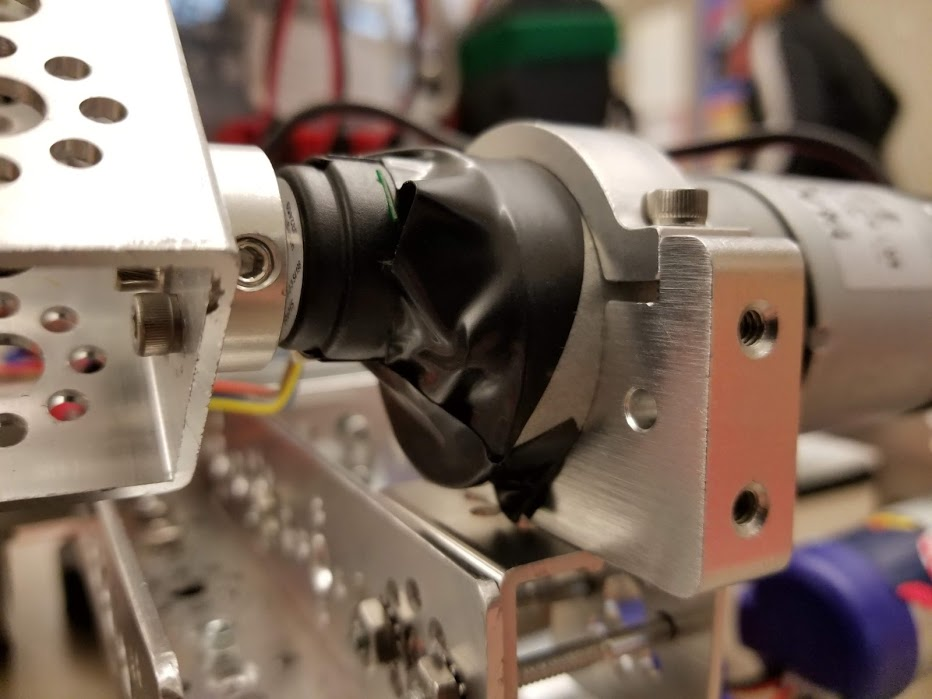
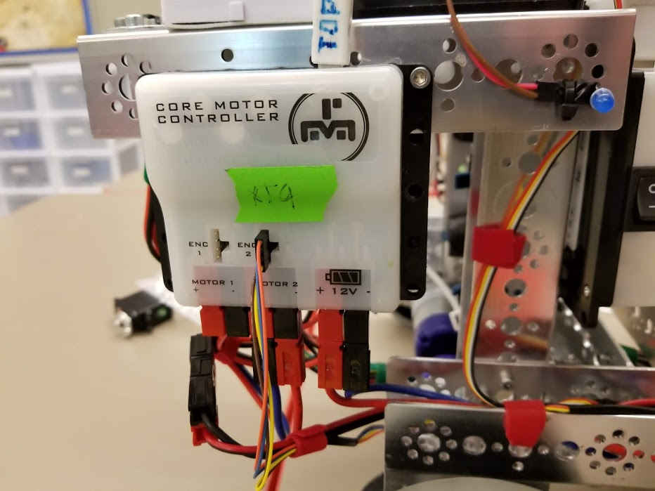
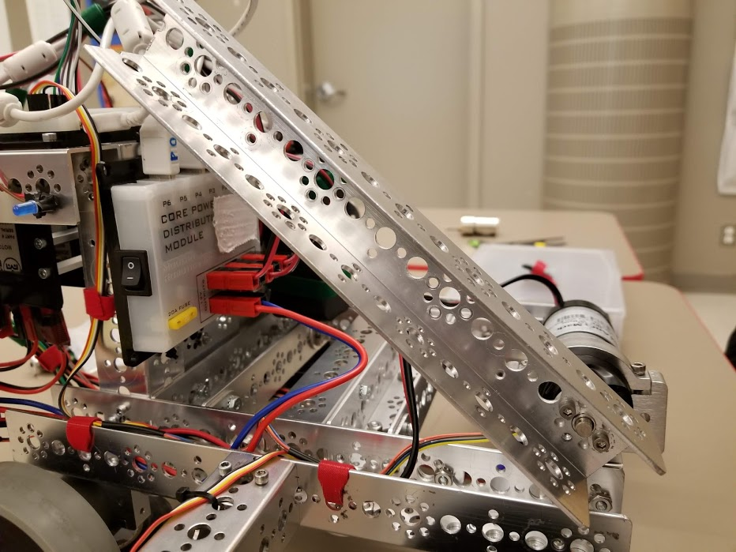
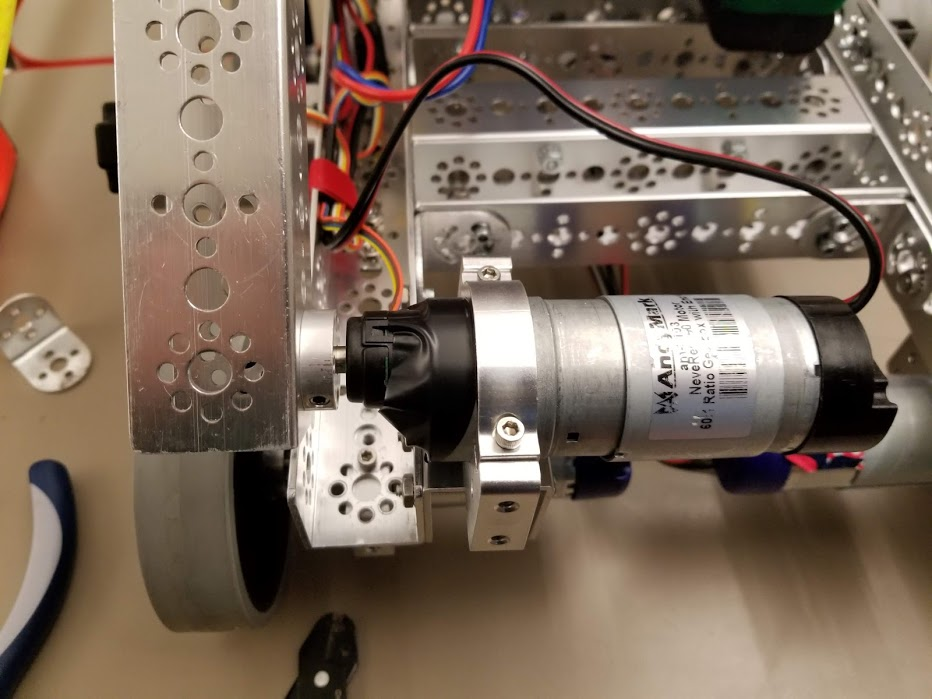

# Engineering Notebook - December 11th
### Members Present:
Aron, Amog, Keith

### Objectives:
- Remove the plow mechanism
- Build an arm mechanism to lift the grip the other group constructed.

### Completed Tasks:
We fully removed all of the parts of the old plow, and added the start of an arm mechanism. We also mounted a third motor controller to the outside of the upper level to allow us to control the motor for the arm mechanism.

### Reflections
We are using a DC motor with an external encoder, since the built-in encoders are only functional on our newer high-torque motors. I tested it with the Core Device Discovery program, and it functions to go to a position, but with much more torque and holding force than a servo motor. The DC motors can also attempt to return to a position if manually moved, allowing us to not worry about bumping into things or falling.

### Details, Diagrams, and Images

