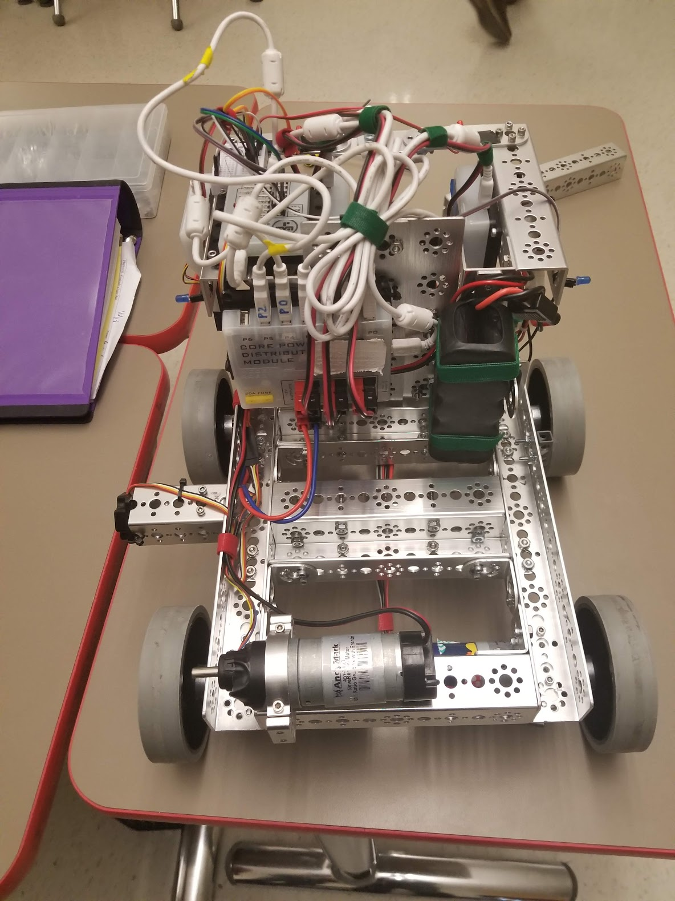
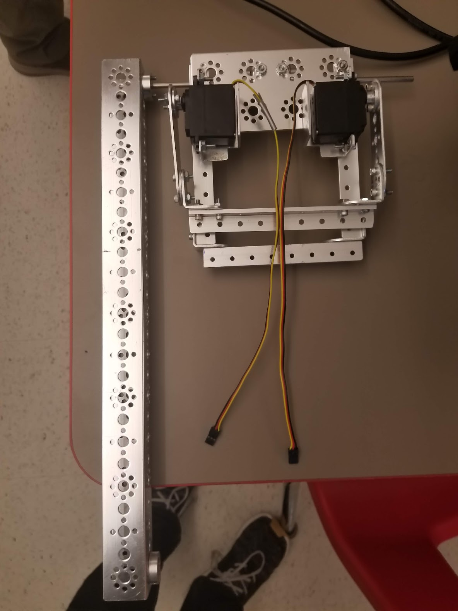

# Engineering Notebook - Template
### Members Present:
Aron, Amog, Keith

### Objectives:
Program the arm with encoder, and reinforce the mounting mechanism of the arm.

### Completed Tasks:
We are able to read the encoder readouts from the arm, and added code to drive the arm to 2 positions based on input from the dpad. We are also able to enable and disable the motor with left and right dpad respectively. Additionally, we attached the other group's grabbing mechanism to the end of our arm.
### Reflections

### Details, Diagrams, and Images

The encoder registers 350 steps per 90 degree turn, so 1400 steps per rotation. We should never need to do a full rotation, since the arm would catch on the body of the robot.

To keep the robot from damaging itself, we will limit the arm to movement between -500 and 100 steps, with 0 being perpendicular to the chassis.

Attaching the grabbing mechanism to the end of the arm unbalanced the arm, and causes the motor to severely overshoot the desired position, to the point of possibly damaging the robot or the playing field. We will attempt to fix this next class by reducing the speed at which the arm moves.

We detached the arm from the DC motor to prevent damage if the robot is turned on before the code is fixed.

This is the somewhat-completed arm. We will probably attach a second arm with no motor to the other side to reinforce it. It is designed to allow the grabbing mechanism to move freely, so that it will always face directly down.

