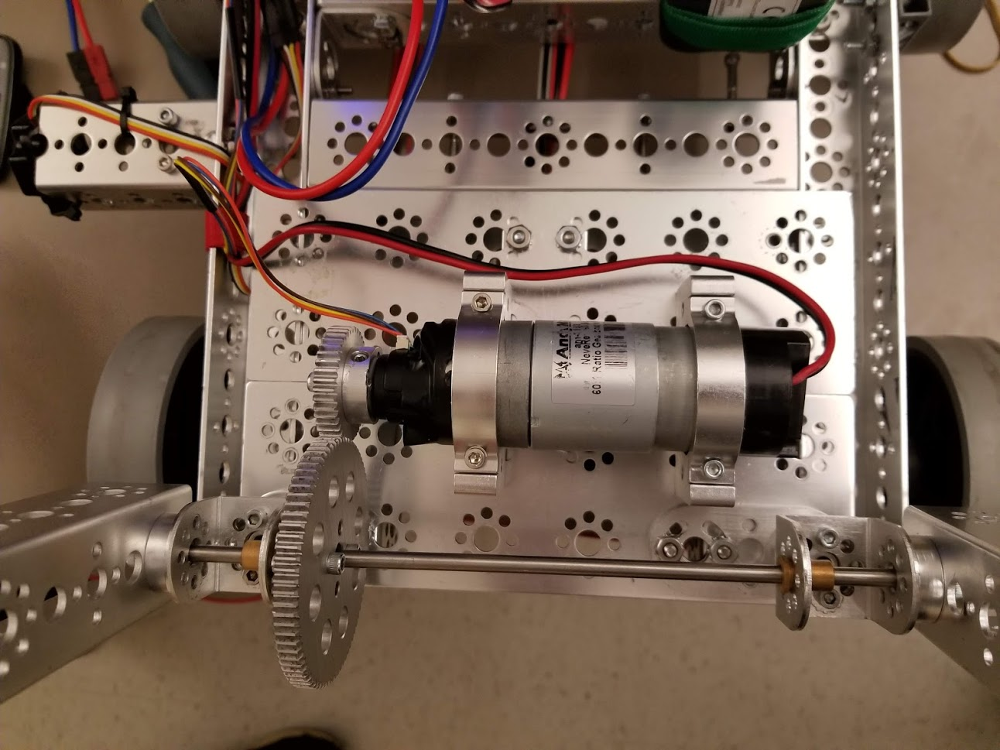

# Engineering Notebook - December 19th
### Members Present:
Amog, Aron, Keith

### Objectives:
Use a gear reduction to stabilize the arm mechanism

### Completed Tasks:
The motor is now driven by a gear reduction.

### Reflections
We changed the arm to use a gear mechanism rather than directly being driven by the motor, and it now works much better than before. The arm wobble is significantly reduced, if there at all, and both sides of the arm can now be driven by the single motor.

### Details, Diagrams, and Images

