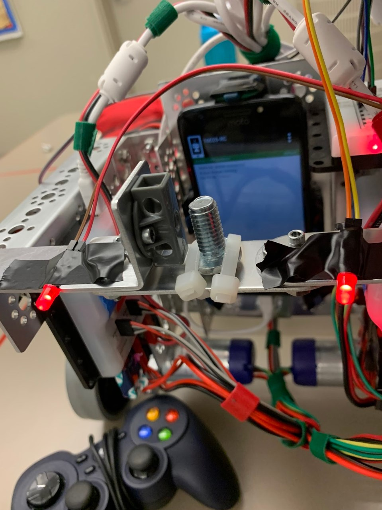
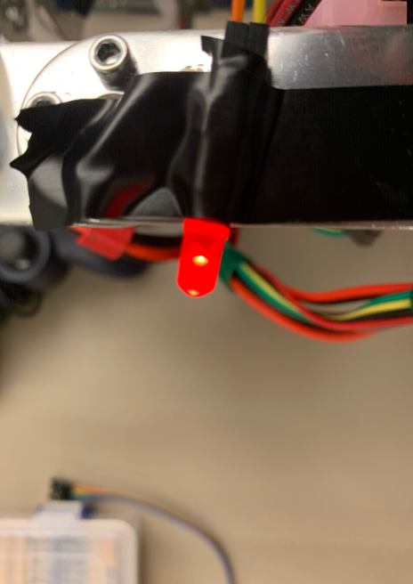
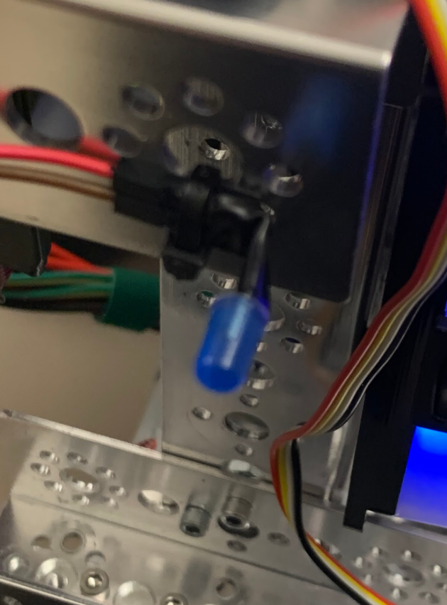
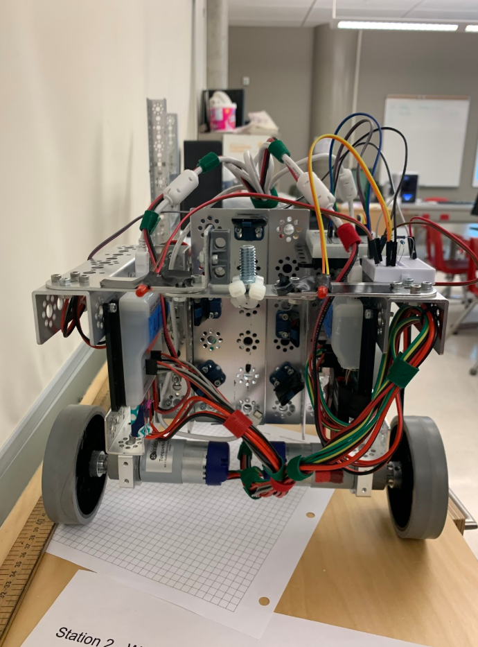
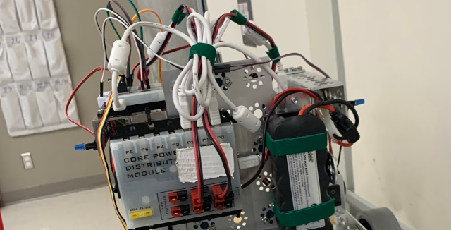

# Engineering Notebook - December 3rd
### Members Present:
Amog, Aron, Keith

### Objectives:
Attach the LED turn and brake lights, as well as a flag mount as required for the competition.

### Completed Tasks:
We added LED lights to add more flair to our robot, and to make it easier to signal to the other team in our alliance what we are planning on doing. Currently, the turn signals are controlled by holding LT or RT.

### Reflections
It would be much easier to have the buttons be toggle, rather than momentary control. I will attempt to add this before next class.

### Details, Diagrams, and Images

Git commit: [https://github.com/ktweed/FTC_2019-20/commit/3c42bd446d854fa9c52e1ce9436dc23c26b2de5d](https://github.com/ktweed/FTC_2019-20/commit/3c42bd446d854fa9c52e1ce9436dc23c26b2de5d)