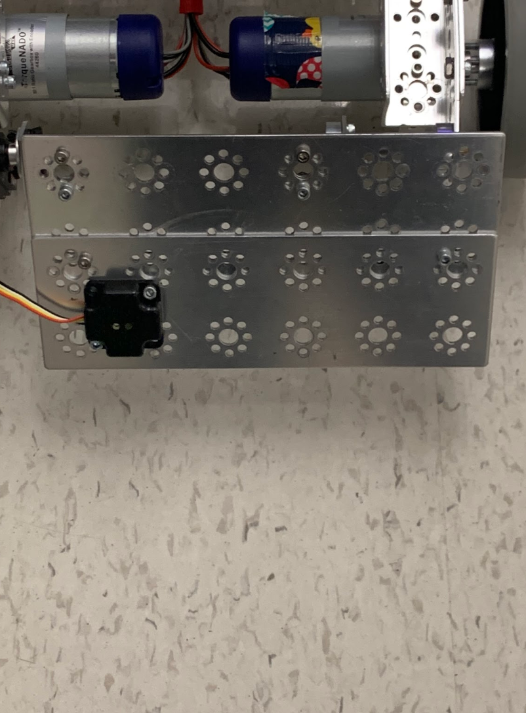
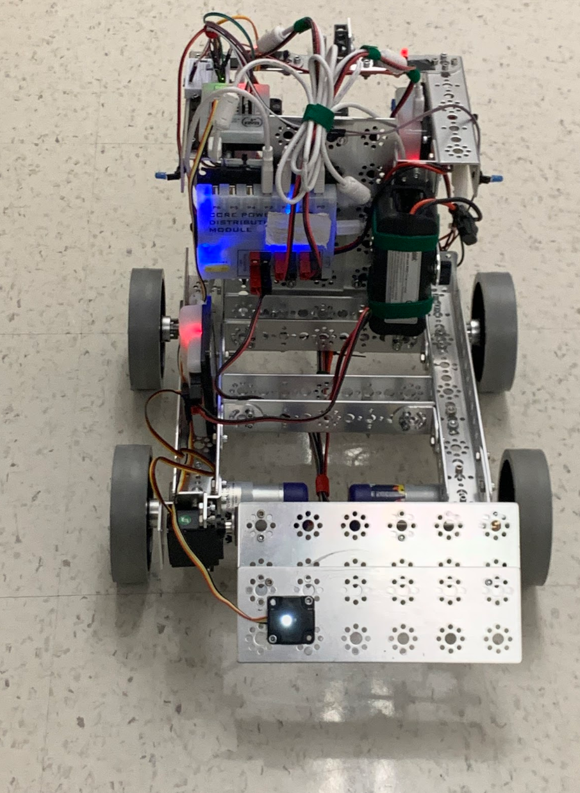
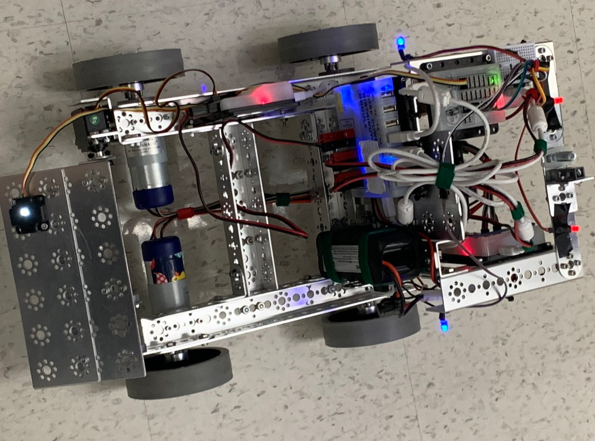

# Engineering Notebook - December 5th
### Members Present:
Amog, Aron, Keith

### Objectives:
Create a bulldozer-style plow for the front of the robot.
- Attach a servo motor
- Assemble a tetrix plate
- Stabilize the opposite side

### Completed Tasks:
We finished attaching the plow, and moved the color sensor onto it to allow us to both detect and move the skystone quickly.

### Reflections
We will need to reinforce the opposite side next class, as it cannot hold itself in place from the single attachment point on the servo.

### Details, Diagrams, and Images

