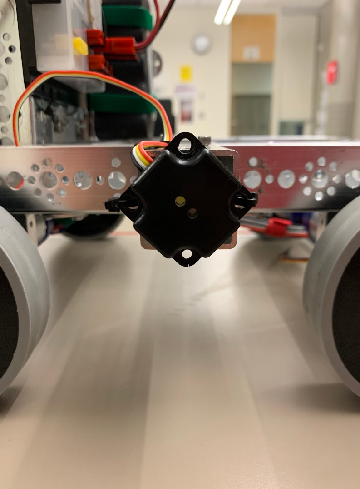
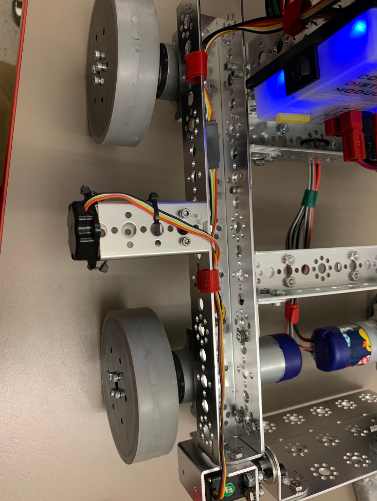
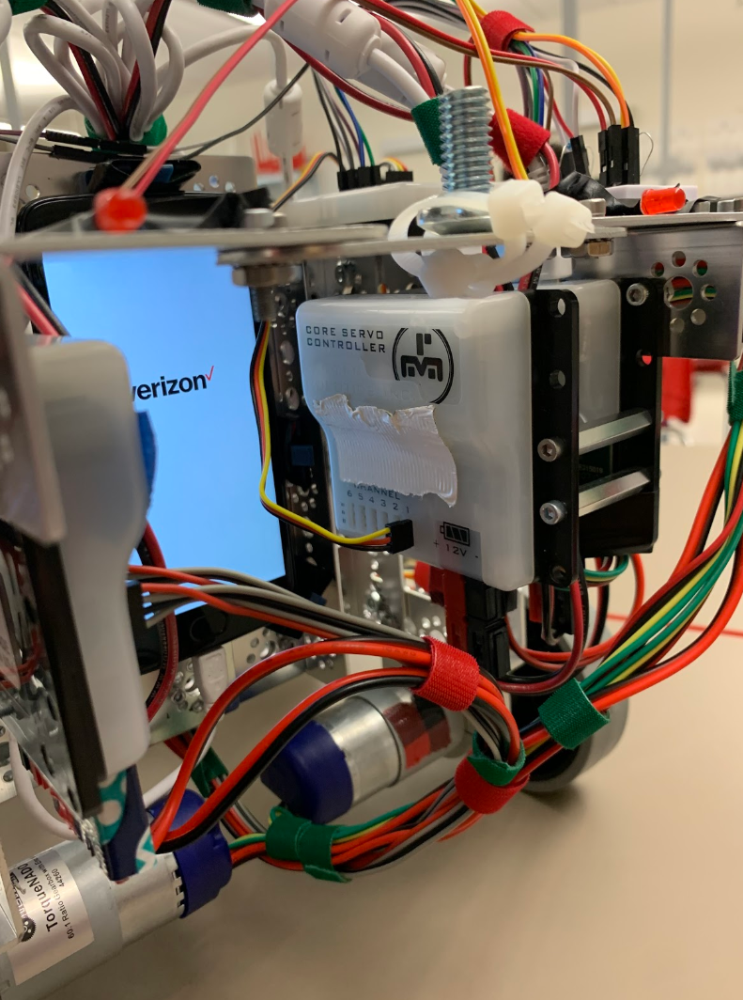
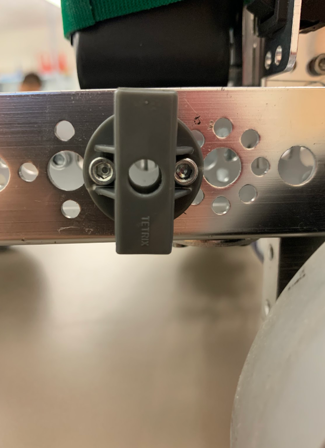

# Engineering Notebook - December 9th
### Members Present:
Amog, Aron, Keith

### Objectives:
- Move the color sensor to the side of the robot
- Attach a servo controller to control the servo of the plow
- Reinfoce the opposite side of the plow

### Completed Tasks:
- Color sensor moved to right side of the robot
- Flag mount moved to side of robot
- Servo controller attached

### Reflections
We decided to move the color sensor to the side of the robot, so that our robot can drive past the row of stones and easily pick out the skystones. We also moved the flag mount so that our robot will be able to move under the alliance-specific bridge. We used standoffs to put the servo controller on top of one of the motor controllers to conserve space in the electronics section of the robot.

We tested the plow with a small c-channel, but it immediately gave way and stopped functioning. The servo was not powerful enough to hold the plate in place, so we decided to scrap the mobile plow idea.

### Details, Diagrams, and Images

