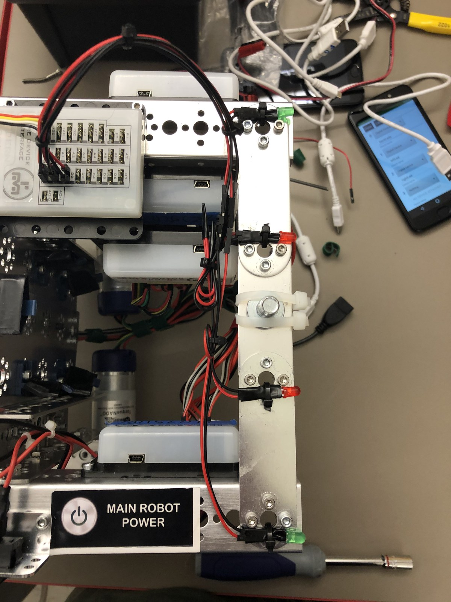
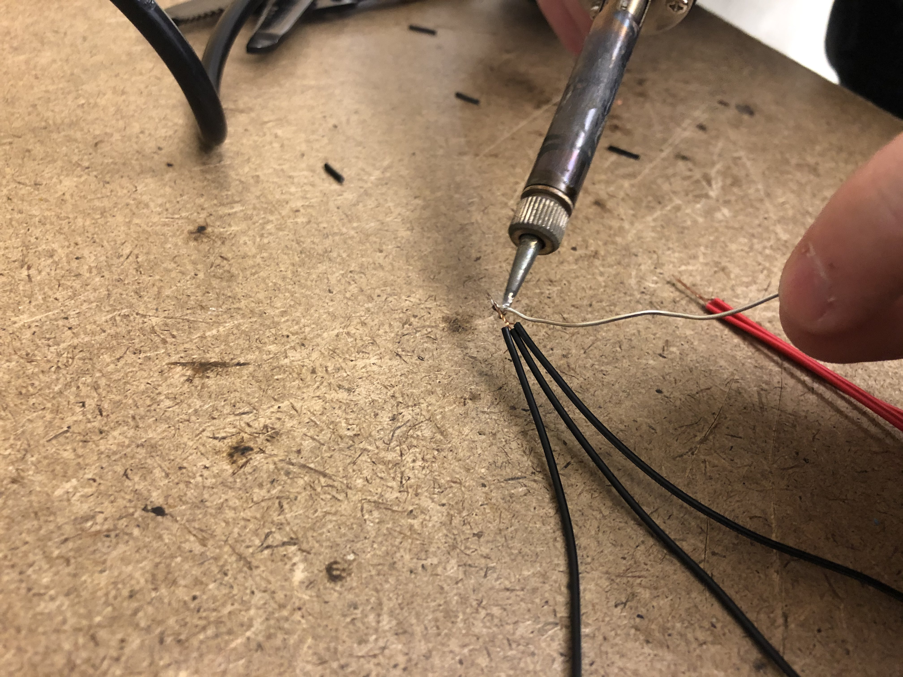

# Engineering Notebook - February 12th.md
### Members Present:
Amog, Aron, Keith

### Objectives:
Rewire our LEDs to be competition-legal.

### Completed Tasks:
We removed the breadboard, opting instead to cut and solder breadboard wires to connect the Core Device Interface to the LEDs. We used black and red wires only to comply with the FIRST rules in section <RE14> (a) and section <RE17> of Game Manual 1.

### Reflections
With the wires properly managed, they look much better than before. They work identically.

### Details, Diagrams, and Images

