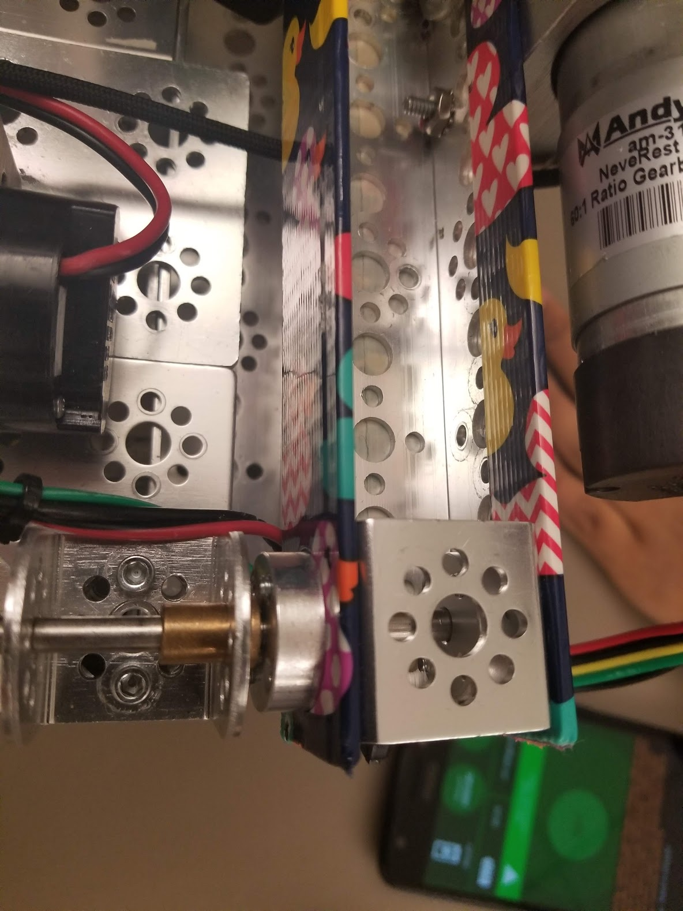
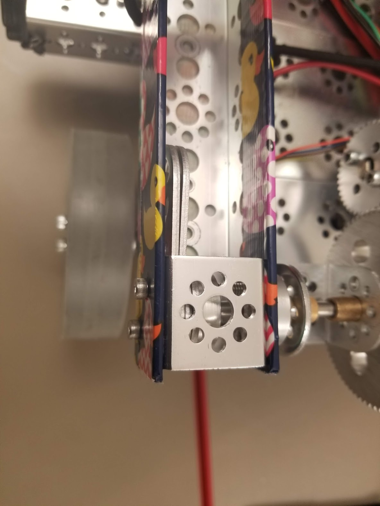
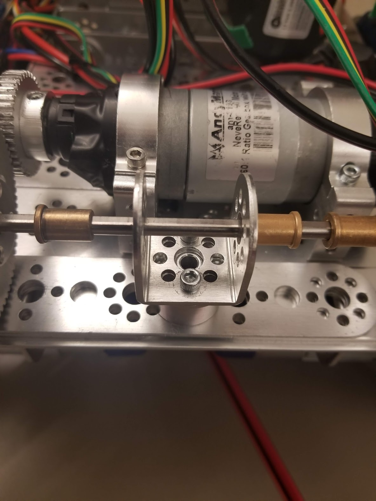

# Engineering Notebook - February 24th
### Members Present:
Amog, Aron, Keith

### Objectives:
Fix the axle mess from the open house
Determine how to prevent the motor from over-torquing the grip mechanism

### Completed Tasks:
The axles and grip mechanism have been completely rebuilt.

### Reflections
If the DC motor spins out again, it will be a big problem. We do not have any move of the axles that we are using nor the parts for the gripper mechanism.

We heavily reinforced the gripper mechanism and added a third support for the axle.

We also added duct tape to the gripper for additional grip, and aesthetic purposes.

### Details, Diagrams, and Images

