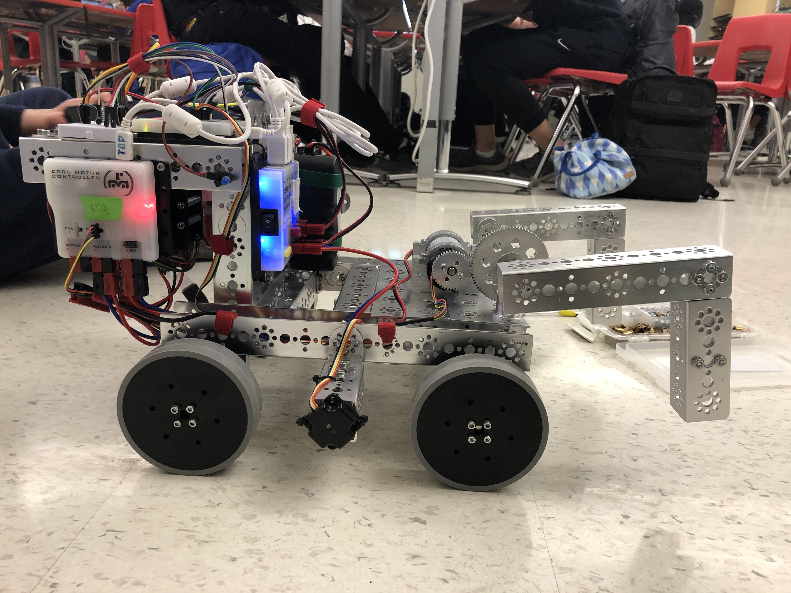

# Engineering Notebook - February 4th
### Members Present:
Aron, Amog, Keith

### Objectives:
Troubleshoot autonomous program and determine a stopgap mechanism for manipulating the blocks

### Completed Tasks:
We were unable to get the autonomous program working, so we will instead go for a more simple program that only moves us onto the line, instead of trying to detect the skystone.

We created a block manipulation mechanism that will allow us to steer blocks around the field, but not lift them.

### Reflections
It is difficult to hone in turn angles, and to visualize how a program will work without trial and error.

### Details, Diagrams, and Images

This is an image of the new block manipulation mechanism. It is not able to lift stones, but it is able to drive around and manouver with them.