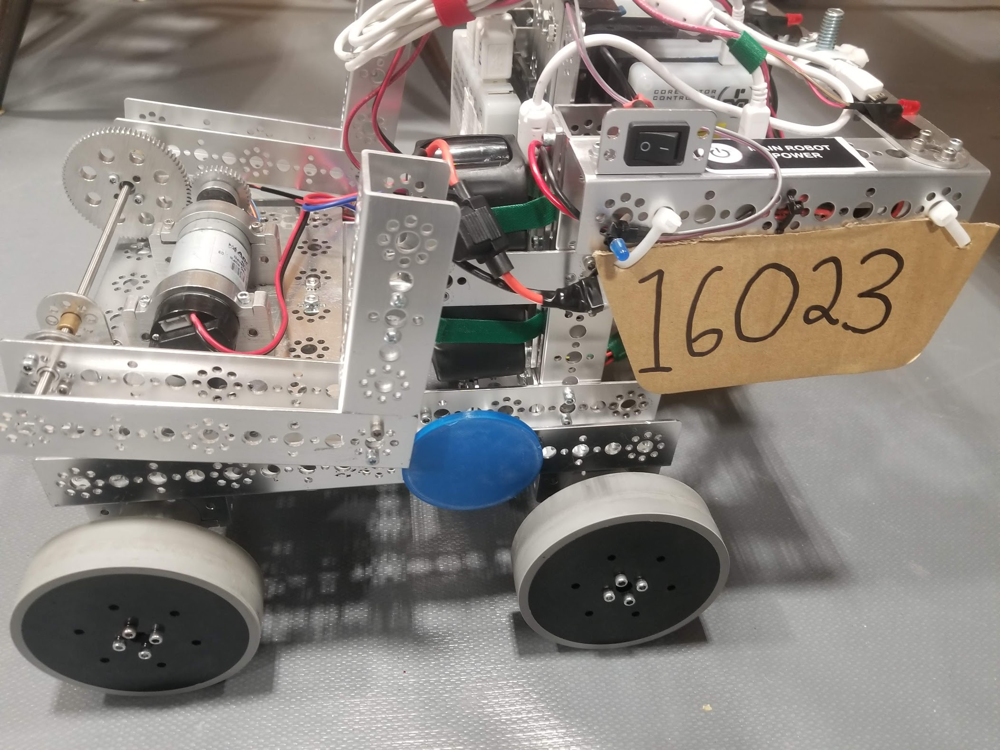
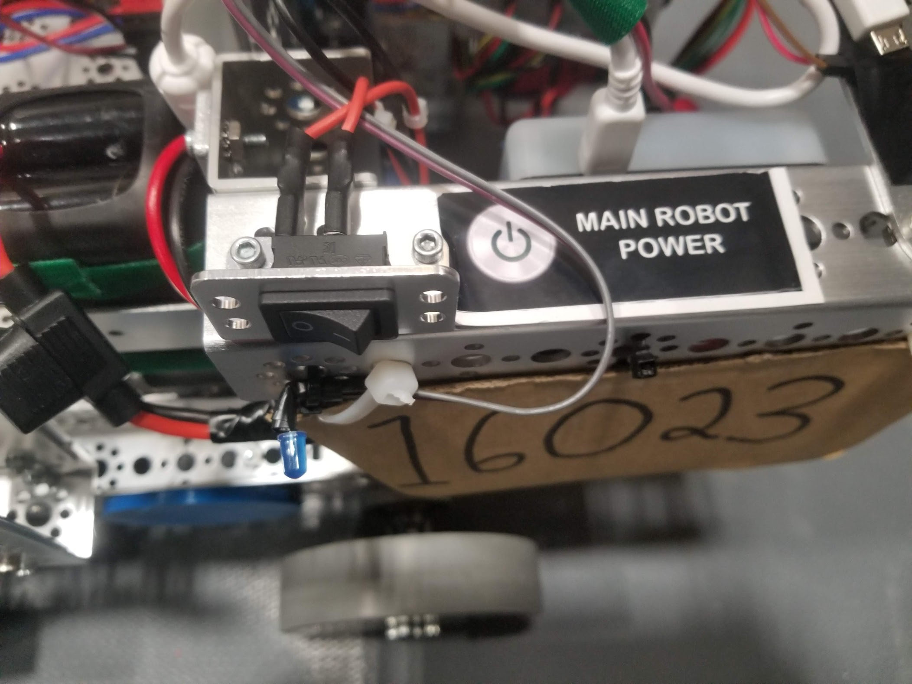
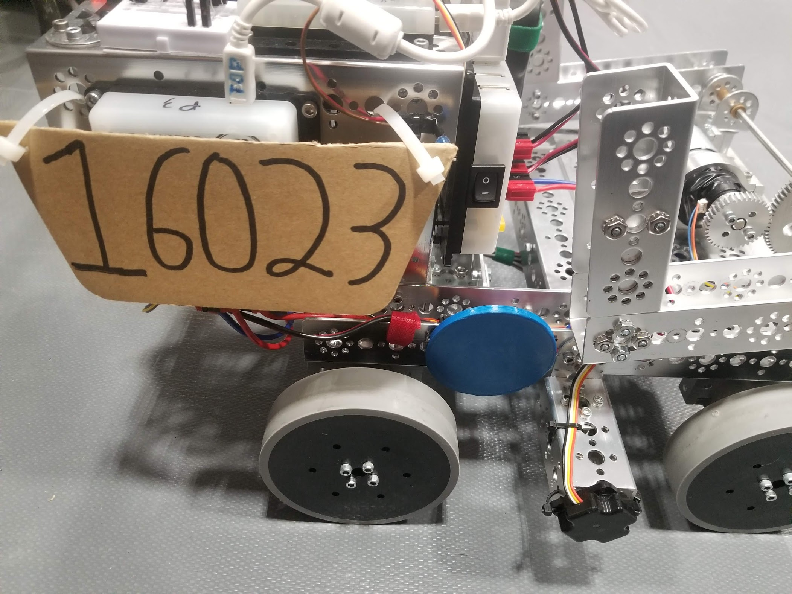
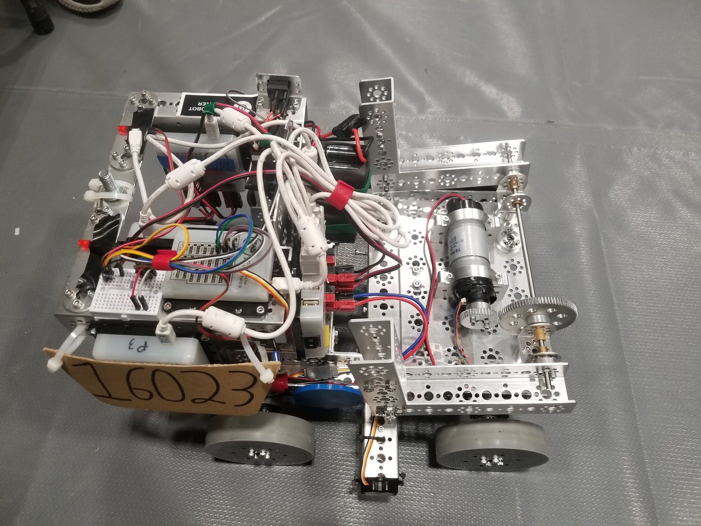

# Engineering Notebook - February 8th
### Members Present:
Amog, Aron, Keith, Jacob Belcourt-Blue, Waleed, Palaash, Shaishav

### Objectives:
Competition Day

### Completed Tasks:
- Passed both inspections

### Reflections
Our robot seemed to do everything we thought it would do, and quite consistently.

### Details, Diagrams, and Images

#### Notes from Driver Meeting
- Depot 
  - One human player that can put stones or capstone into the depot *while it is clear of items or robots*
  - No placing items in other team's depots in order to block them from introducing elements
  - No purposefully removing items from the other team's depot
  - You *can* pass through the other team's depot, but you **cannot** touch the other team's stones or capstones.
- Human players must be identified immediately, and items placed on the field **cannot be removed**
- Autonomous period
  - Once the autonomous period has started, you CAN NOT touch the controllers or the phones
    - Major penalty
    - You cannot stop it, you must let it run *unless you are told to by a referee*
  - You cannot touch the other team's foundation (penalty) unless the other team has already moved their foundation into your way.
- A question mark will be in the competiton zone. You may ask questions to the referees by having one youth player stand there. There will be no video replays.

#### Ideas for Future Competitions
- Mechanum wheels? Strafing seems quite useful
- Our robot works quite well for support, and can move the foundation out
- Practice more
- Put some loctite on the set screws for the arm and wheels to ensure they don't come loose (lots of vibration during turns)
- Buttons on the side of the robot to detect a collision and stop the auto program to prevent us from hurting ourselves if we hit a robot and go off course (Healios)

#### Other Notes
- We **need** to ensure that breadboards are competition legal before provincials, or solder the resistors and wires directly together.

#### Images

