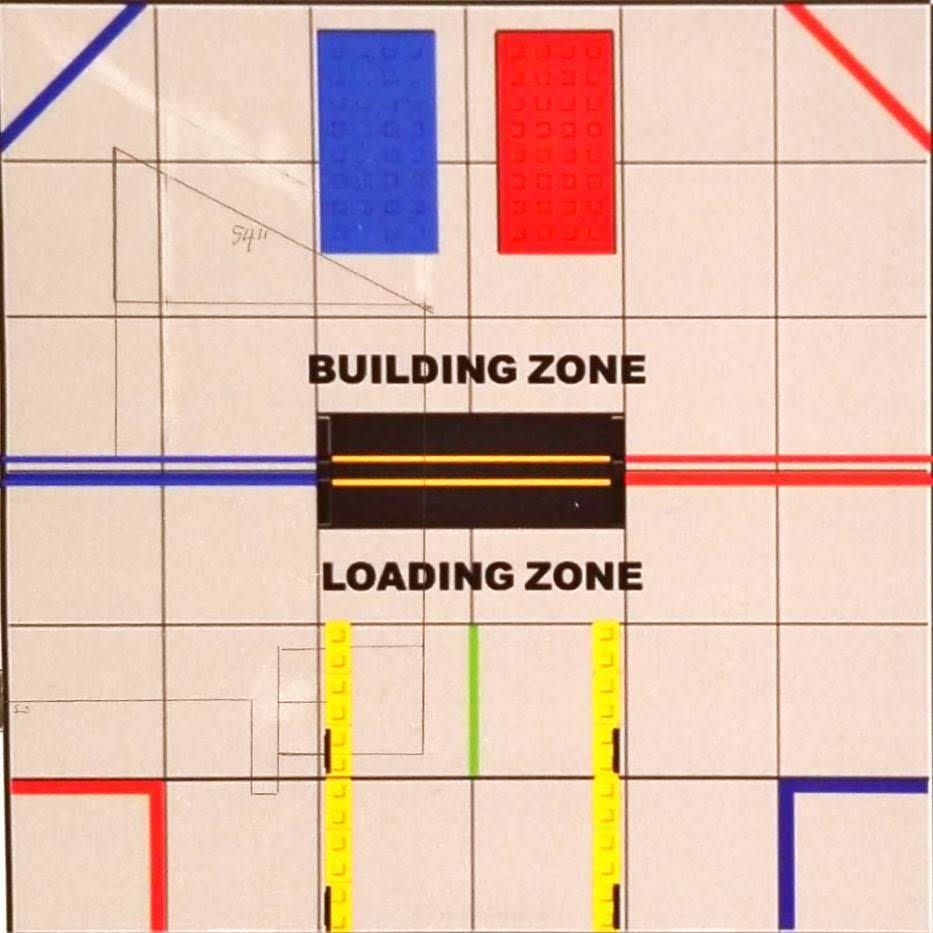

# Engineering Notebook - January 6th
### Members Present:
Amog, Aron, Keith

### Objectives:
Plan out an autonomous period course

### Completed Tasks:
We decided on the scoring mechanics that we will go for in the competition

### Reflections
We decided to go for one of the two skystones, as well as moving the foundation and parking over the center line.

### Details, Diagrams, and Images

This is our idea for the competition route. First, our robot will attempt to sample for the skystones using the color sensor. It will then grab the skystone and move it over to the build site. It will then move the foundation into the corner, and finally park over the center alliance-specific line. We hope that this will come in under 30 seconds, and that we will be able to do this effectively before the competition date.
