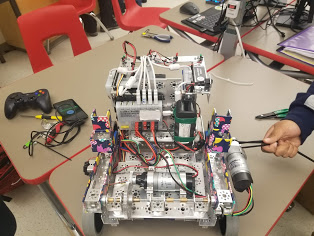
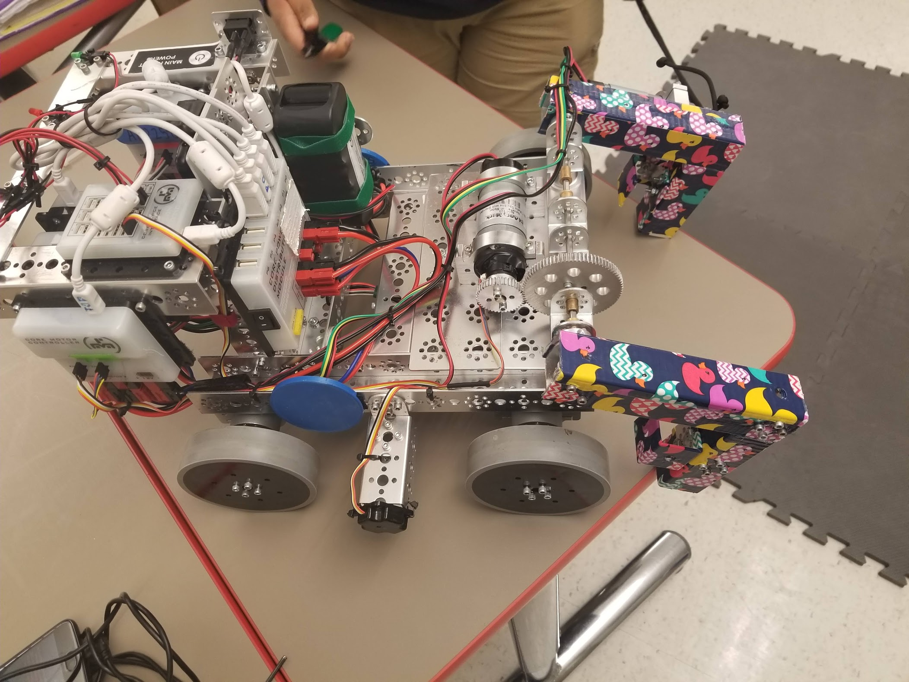

# Engineering Notebook - March 3rd
### Members Present:
Amog, Aron, Keith

### Objectives:
Practice driving for the competition, and add fail-safe code for the gripper mechanism

### Completed Tasks:
Amog practiced driving on a partial course

I wrote code so that when the right stick is pressed, the gripper motor will shut off. This should help prevent damage.

### Reflections
Our robot seems competition ready, I really hope we do well in the competition on Saturday/Sunday

### Details, Diagrams, and Images

