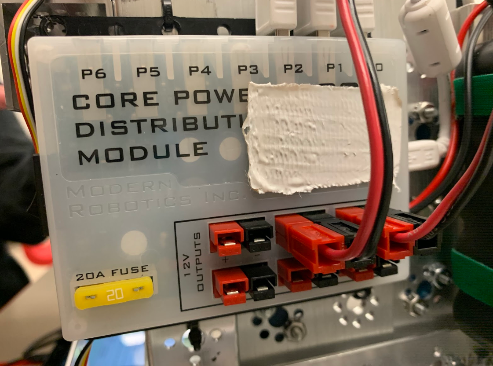
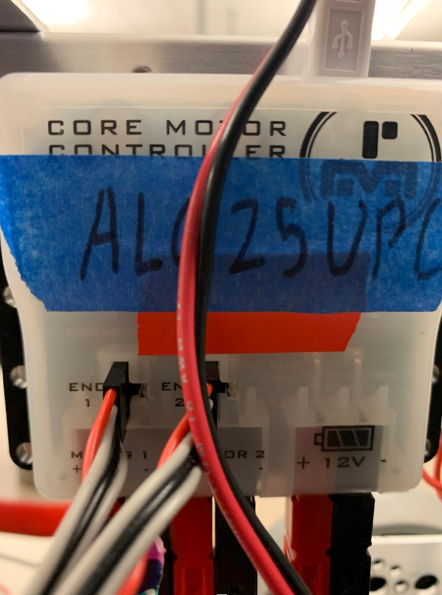
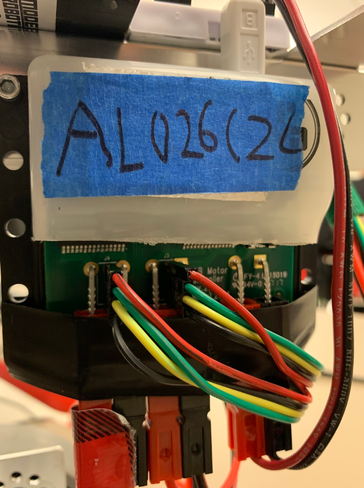

# Engineering Notebook - November 18th
### Members Present:
Aron, Amog, Keith

### Objectives:
Finish connecting the control modules, and ensure that the wires are kept tidy.

### Completed Tasks:
All of the motors are now connected to the controllers, and the controllers are all connected to the core power distribution module. We also attached the main power switch.

### Reflections
Since we have a similar build in terms of motors to last year's robot, we should be able to easily adapt the code we used last year to work for this year's robot.

### Details, Diagrams, and Images

We had to cut off part of the casing of the DC motor controller, since the encoder wires wouldn't fit.

