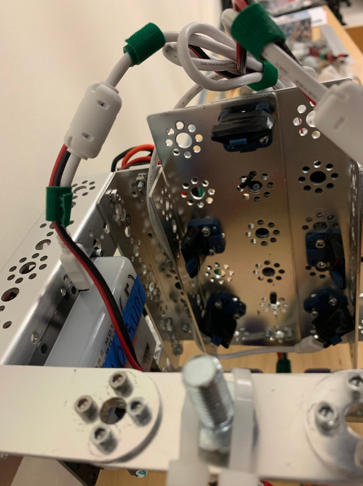

# Engineering Notebook - November 20th
### Members Present:
Aron, Amog, Keith

### Objectives:
Test the electronic components and mount the phone to the chassis

### Completed Tasks:
We used Modern Robotics' Core Device Discovery to manually move all of the motors and read their encoders, and all of them are fully functional. We also attached wheels to the robot, deciding on traditional wheels as opposed to the mechanum wheels used last year. We also built the phone mount for the robot.

### Reflections
The mechanum wheels didn't work very well last year, so the standard wheels should allow us a faster forward speed.

### Details, Diagrams, and Images
This is the phone mount we constructed, that doesn't obstruct the phone's screen, buttons, and ports.

These are the wheels we decided to use

