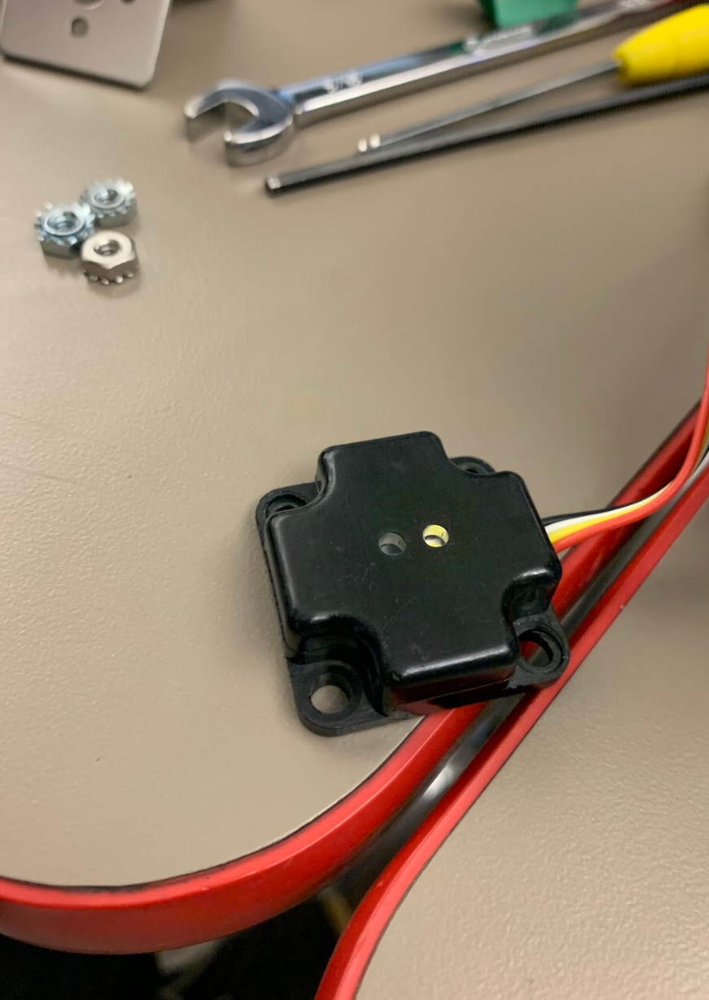

# Engineering Notebook - November 26th
### Members Present:
Amog, Aron, Keith

### Objectives:
Attach a color sensor, and write code to test it in the TeleOp.

### Completed Tasks:
We attached the color sensor to the front of the robot, in order to tell if stones are skystones or regular stones during the autonomous period.

### Reflections
The color sensor only has a range of a couple centimeters, so we will need to be very close to the stones to get a reading.

### Details, Diagrams, and Images
These are the color sensors we are using, from Modern Robotics.

This is the color sensor attached to the front of our robot.

