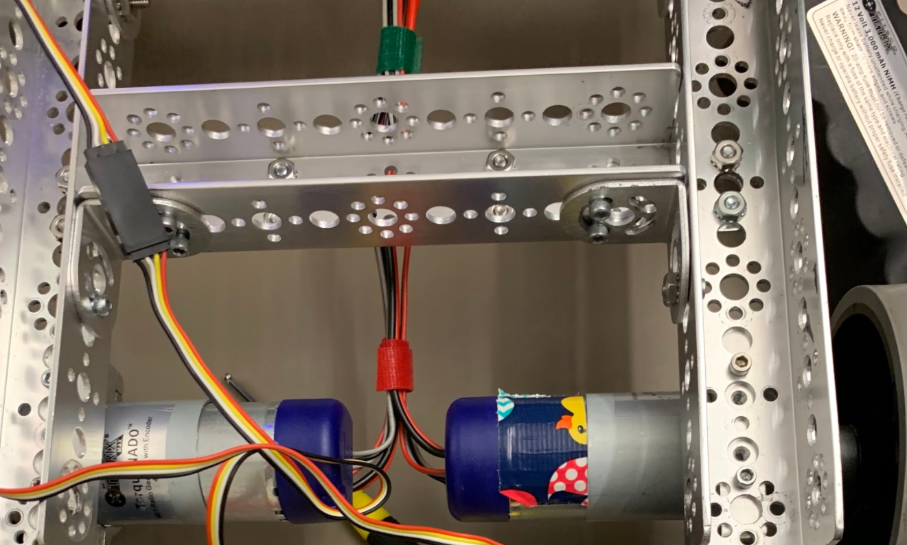

# Engineering Notebook - November 7th
### Members Present:
Amog, Aron, Keith

### Objectives:
Assemble the previously designed chassis, and attach the motors and motor mounts to the chassis

### Completed Tasks:
We moved the supporting C-channels proposed in the middle in the design, further towards the back in order to allow more room in the front for interaction, and to allow the upper layer to hang off the back to free up more space on the ground level.

### Reflections
The robot may be a bit back-heavy, if so we can add more weight to the front with an arm or lift mechanism.

### Details, Diagrams, and Images

This is the front of our chassis with the motors and wheels attached and the wires being managed towards the rear, where we will mount the motor controllers.